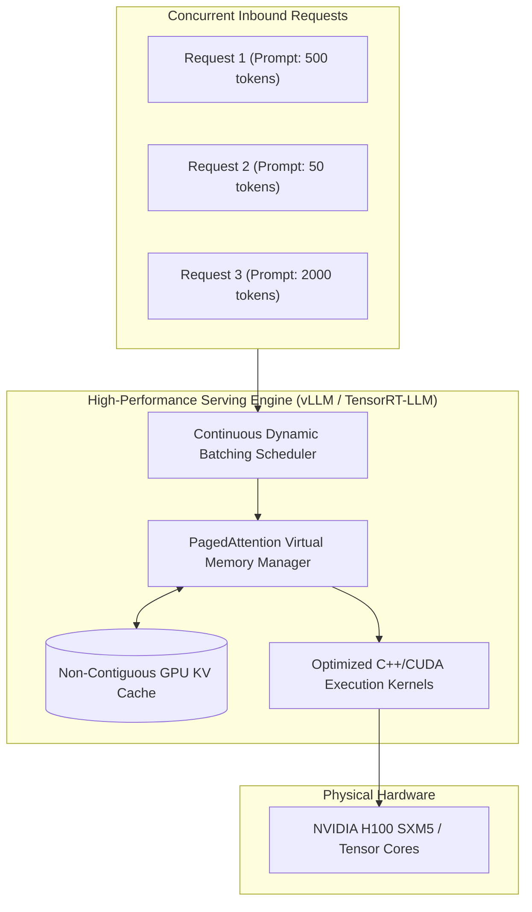

# High-Performance Model Serving Architecture

## 1. Executive Summary & Serving Runtimes

When deploying open-weights foundation models (Llama 3, Mistral, Qwen) in enterprise environments, naive Python frameworks (such as raw Flask or FastAPI wrapping HuggingFace Transformers) collapse under concurrent production traffic, achieving fewer than 5 tokens per second per user.

Modern **High-Performance Model Serving Engines** utilize low-level C++/CUDA kernels, optimized memory allocators, and hardware-accelerated attention algorithms to maximize GPU compute utilization.

---

## 2. Serving Engine Architectural Comparison

| Engine | Primary Strength | Architecture Focus | Ideal Enterprise Use Case |
| :--- | :--- | :--- | :--- |
| **vLLM** | Exceptional ease-of-use, high throughput, PagedAttention. | Dynamic continuous batching, distributed tensor parallelism. | General enterprise multi-model self-hosted clusters on Kubernetes. |
| **TensorRT-LLM** | Maximum possible NVIDIA hardware throughput. | Deep graph compilation, FP8 optimization, specialized Hopper kernels. | Large-scale dedicated model endpoints with static model architectures. |
| **Triton Inference Server**| Multi-framework support (PyTorch, ONNX, TensorRT, vLLM backend). | Enterprise model serving platform, dynamic batching, ensemble pipelines. | Heterogeneous enterprise platforms serving classical ML + LLMs simultaneously. |
| **TGI (Text Generation Inference)**| Cloud-native Kubernetes deployment, production-grade metrics. | Rust/Python architecture, flash-attention, token streaming. | Out-of-the-box Kubernetes clusters with native Prometheus observability. |
