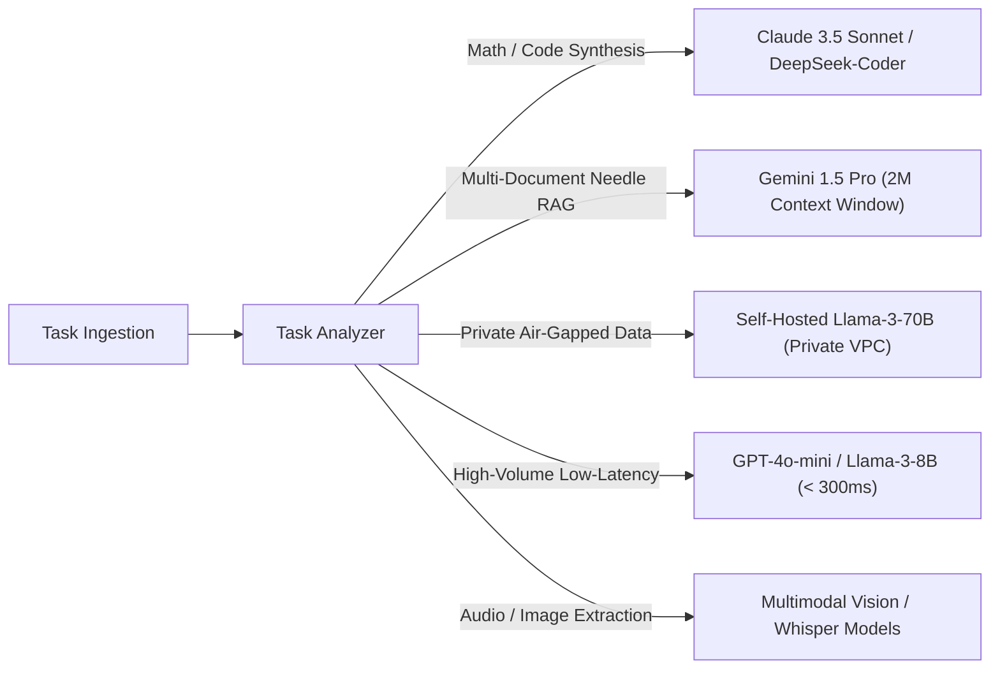

# Multi-Model Platform Architecture

## 1. The Single-Model Anti-Pattern

Relying on a single foundation model across an entire enterprise creates severe architectural compromises:
* Using a flagship model for simple categorization results in **10x cost inflation**.
* Using a lightweight model for complex multi-step reasoning results in **unacceptable failure rates**.
* Using a closed proprietary model for sensitive on-premise data results in **regulatory compliance violations**.

A **Multi-Model Platform** orchestrates a heterogeneous portfolio of specialized models, matching the exact requirements of each workload to the most suitable engine.

---

## 2. Multi-Model Portfolio Matrix

| Model Class | Representative Models | Primary Strengths | Architectural Assignment |
| :--- | :--- | :--- | :--- |
| **Flagship Reasoning** | Claude 3.5 Sonnet, GPT-4o, OpenAI o1 | Complex logical deduction, multi-step code generation, deep ambiguity resolution. | Agent planning loops, high-stakes financial analysis, architecture reviews. |
| **High-Throughput SLMs** | GPT-4o-mini, Claude 3.5 Haiku, Llama-3-8B | Extreme speed (100+ tps), rock-bottom token cost ($< \$0.20 / M$). | Classification, sentiment analysis, query rewriting, metadata extraction. |
| **Massive Context Models**| Gemini 1.5 Pro | 1M – 2M token active context window. | Analyzing entire codebases, multi-hour audio transcripts, annual financial 10-Ks. |
| **Open-Weights Private** | Llama-3-70B, Mistral Large, Qwen 2.5 | Air-gapped deployment, zero vendor data retention, customizable weights. | Strictly regulated health records, classified defense data, high-volume on-premise workloads. |
