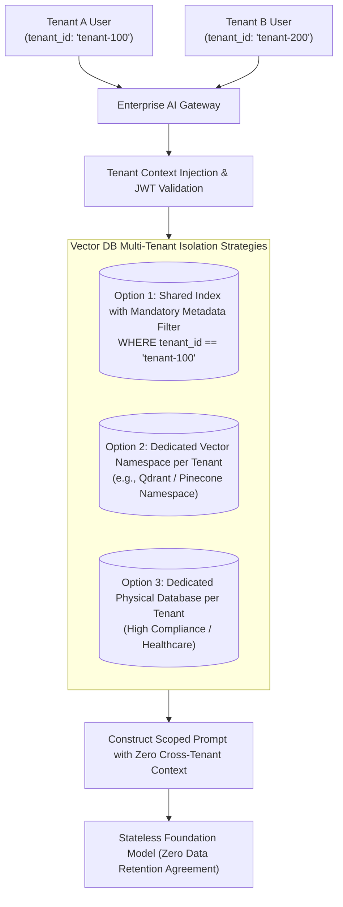

# Multi-Tenant AI Platform Architecture

## 1. The Zero Data Leakage Imperative

In an enterprise B2B SaaS platform or shared corporate environment, **Tenant A must NEVER retrieve, infer, or access Tenant B's confidential information**.

Multi-Tenant AI Architecture enforces cryptographic and logical tenant isolation across all layers: API gateways, prompt templates, vector databases, document embeddings, and model fine-tuning weights.

---

## 2. Multi-Tenancy Patterns for Vector Databases

| Pattern | Isolation Level | Operational Overhead | Cost Efficiency | Recommended Use Case |
| :--- | :--- | :--- | :--- | :--- |
| **Metadata Filtering** | Logical (Filter Clause) | Minimal (Single index) | Maximum ($1\times$) | Standard B2B SaaS with thousands of small-to-medium tenants. |
| **Dedicated Namespaces** | Medium (Isolated partition) | Low (Single cluster) | High ($1.1\times$) | Mid-market enterprise tiers requiring guaranteed partition boundaries. |
| **Dedicated Database Cluster**| Physical (Separate cluster) | High (Separate infra) | Low ($5\times - 10\times$) | Tier-1 regulated banking/healthcare clients with strict contractual separation. |

### Architectural Invariant: Mandatory Filter Injection
The AI Gateway must inject the authenticated `tenant_id` into all vector database queries at the gateway middleware layer. The client application is never trusted to pass the `tenant_id` as a query parameter, completely eliminating BOLA/IDOR vulnerabilities.
