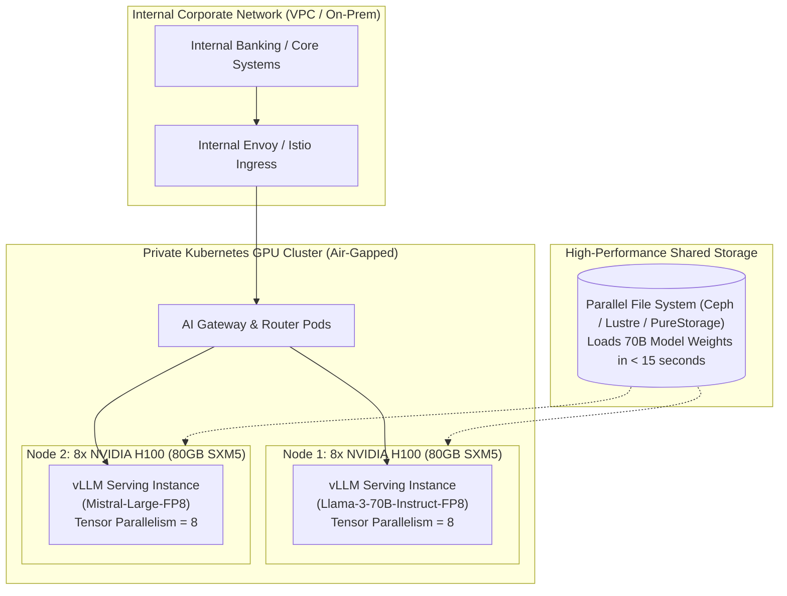

# Self-Hosted AI Platform Architecture

## 1. Executive Summary & When to Self-Host

While public cloud foundation model APIs (Azure OpenAI, AWS Bedrock, Google Vertex AI) offer rapid time-to-market, global enterprises with **extreme data residency mandates, air-gapped defense networks, high sustained query volumes (> 100M tokens/day), or strict cost-per-token ceilings** must architect a private, self-hosted AI platform.

---

## 2. Infrastructure Sizing & Hardware Realities

### 2.1 Tensor Parallelism Across GPUs
For a 70B parameter model in FP16 (requiring $\sim 140\text{GB}$ VRAM for weights plus $40\text{GB}$ for KV cache), the model cannot fit on a single GPU. It must be split across multiple GPUs using **Tensor Parallelism (TP)**:
* Standard configuration: $8\times 80\text{GB H100}$ interconnected via high-speed **NVLink** ($900\text{GB/s}$ bidirectional bandwidth).
* **Warning**: Never attempt Tensor Parallelism across standard PCIe slots or separate nodes without InfiniBand interconnects; the inter-GPU communication latency will destroy generation throughput.

### 2.2 Fast Model Weight Loading
Standard Docker images should not bundle 140GB model weights. Kubernetes pods should mount high-speed shared NVMe storage (NFS/Ceph) or use memory-mapped files (`mmap`) to initialize and scale inference pods in seconds rather than downloading multi-gigabyte files across the network.
