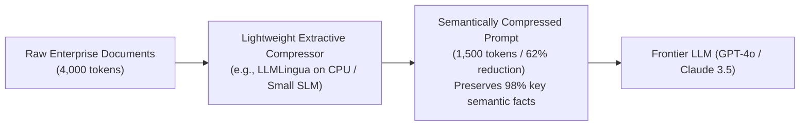

# Context Compression & Semantic Pruning Architecture

## 1. Eliminating Context Bloat

Enterprise documents and conversation histories are full of lexical noise: repeated greeting headers, legal disclaimers, boilerplate disclaimers, and redundant stop words. Passing unpruned raw text directly to LLMs wastes enterprise token budgets.

**Context Compression Engines** (e.g., LLMLingua, semantic extractive compressors) analyze token perplexity using lightweight small models to strip out low-information tokens before calling the expensive foundation model.

---

## 2. Architectural ROI of Context Compression
* **Cost Savings**: In high-volume enterprise workloads, a 50% reduction in input token count directly halves monthly foundation model API expenditures.
* **Latency Reduction**: Reducing prompt tokens from 8k to 3k reduces Time-to-First-Token (TTFT) by up to 60%.
