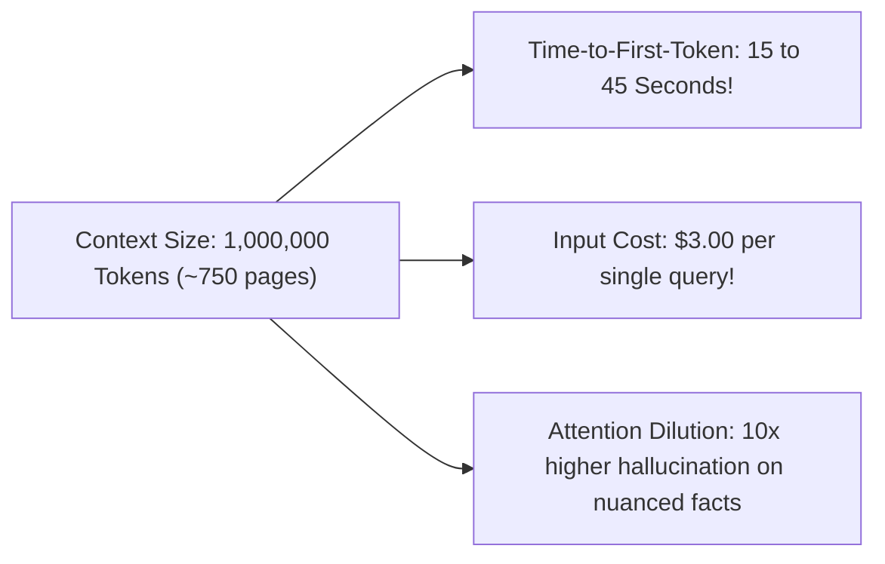

# Context Window Dynamics & The Long-Context Fallacy

## 1. The Physics of Massive Context Windows

While frontier models (Gemini 1.5 Pro, Claude 3.5 Sonnet) support context windows exceeding 1,000,000 tokens, system architects must recognize the severe operational penalties of large contexts:

---

## 2. Context Window Decision Matrix

| Context Sizing Tier | Best Suited Architectural Tasks | When NOT to Use |
| :--- | :--- | :--- |
| **Short Context (< 8k tokens)** | Transactional RAG, customer chat, classification, entity extraction. | Multi-document comprehensive cross-analysis. |
| **Medium Context (8k - 32k tokens)** | Full technical document review, single code repository file refactoring. | Real-time low-latency SLA (< 1s) endpoints. |
| **Massive Context (100k - 2M tokens)**| Offline annual report auditing, legal contract discovery, whole-codebase migrations. | Customer-facing real-time applications; high-volume transactional APIs. |
