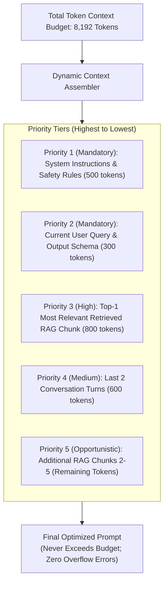

# Dynamic Context Assembly & The Knapsack Token Budget

## 1. Deterministic Context Budget Allocation

When assembling a prompt from heterogeneous enterprise sources (system instructions, conversation history, user preferences, enterprise RAG documents, and tool definitions), the total token count can easily exceed model limits.

A **Dynamic Context Assembler** treats context allocation as a **Bounded Knapsack Problem**, prioritizing context segments based on architectural criticality.

