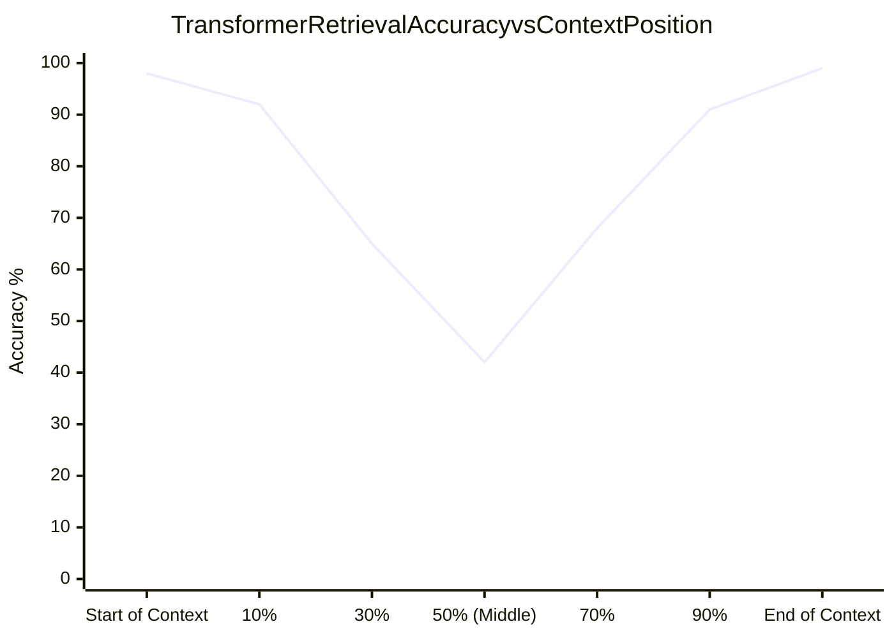

# Lost-in-the-Middle Phenomenon & Attention Optimization

## 1. The U-Shaped Attention Curve

Empirical research across all major transformer models reveals a consistent cognitive bias: **transformers attend heavily to information at the very beginning and the very end of their context window, but frequently ignore or miss facts buried in the middle**.

---

## 2. Architectural Mitigations

1. **Strategic Prompt Layout**: Place the most critical instructions and the user's primary query at the very beginning (system prompt) and the very end (immediate user turn).
2. **Ranked Chunk Placement**: When injecting top-$K$ retrieved RAG chunks, never arrange them in descending order of relevance. Instead, place the #1 most relevant chunk at the **end** of the context block, the #2 chunk at the **beginning**, and the lower-ranked chunks (#3, #4, #5) in the middle.
