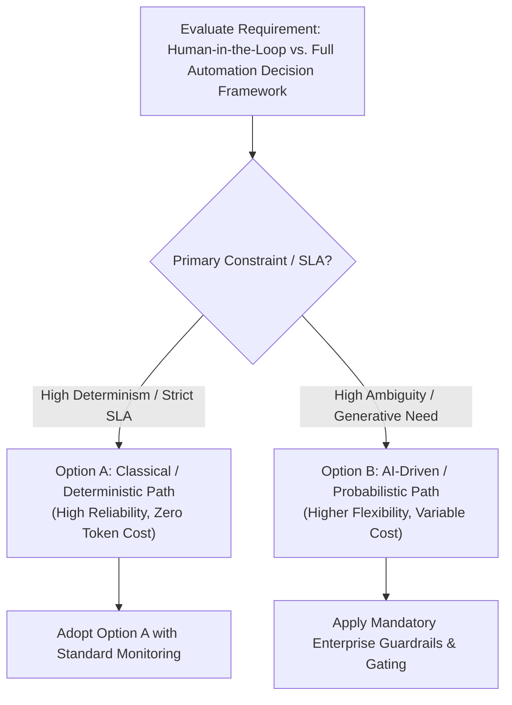

# Human-in-the-Loop vs. Full Automation Decision Framework

## 1. Executive Summary & Context
Risk-tiered gating criteria governing when AI can act autonomously vs. when mandatory human approval is non-negotiable.

---

## 2. Decision Flowchart

---

## 3. Multi-Dimensional Evaluation Matrix

| Evaluation Dimension | Option A (Deterministic / Classical) | Option B (Probabilistic / AI-Driven) | Architectural Evaluation Guidance |
| :--- | :--- | :--- | :--- |
| **Accuracy & Determinism** | 100% predictable; reproducible. | Probabilistic; subject to temperature drift. | If failure tolerance is 0%, choose Option A. |
| **Latency Profile** | Sub-10ms execution. | 500ms – 15s execution. | Real-time transactional paths favor Option A. |
| **Cost Predictability** | Fixed compute costs (CPU/RAM). | Variable OpEx based on token volume. | Budget ceilings require token limiters for Option B. |
| **Flexibility & Generalization**| Rigid; requires code changes for new rules. | High; generalizes zero-shot to new patterns. | High-variance unstructured domains favor Option B. |
| **Operational Complexity** | Standard DevOps & CI/CD. | MLOps, vector indexing, evaluation gates. | Assess team operational maturity. |

---

## 4. Quantitative Decision Scoring Formula
$$\text{Score} = 0.35(\text{Business Value}) + 0.25(\text{Reliability SLA}) - 0.20(\text{Total Cost of Ownership}) - 0.20(\text{Operational Risk})$$
* **Score $\ge 0.70$**: Proceed with Option B (AI capability).
* **Score $< 0.70$**: Enforce Option A (Deterministic software / Rules engine / Classical ML).

---

## 5. Architectural Invariants
1. **Never Default to AI**: Classical software and deterministic heuristics must be formally evaluated and rejected before adopting probabilistic models.
2. **Explicit Fallback Path**: Every AI architecture must define a deterministic fallback if the model fails or times out.
