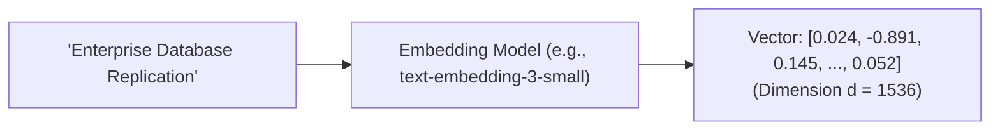

# Embedding Models & Dimensionality Sizing

## 1. The Vector Representation of Semantics

An embedding model maps a sequence of tokens into a fixed-length dense vector of floating-point numbers:
$$f_{\theta}: \text{Text} \to \mathbb{R}^d$$
Where $d \in \{384, 768, 1024, 1536, 3072\}$.

---

## 2. Dimensional Sizing & Memory Calculations

The dimension $d$ directly determines RAM requirements for vector databases:
$$\text{RAM per Vector} = d \times 4\text{ bytes (FP32)}$$
* For 10,000,000 vectors with $d = 1536$:
  $$\text{Raw Memory} = 10,000,000 \times 1,536 \times 4\text{ bytes} \approx 61.44\text{ GB RAM}$$
* Plus HNSW graph index overhead ($\approx 1.5\times \text{raw data}$): **Total RAM Required $\approx 92\text{ GB}$**.

### Matryoshka Embeddings (Truncatable Dimensions)
Modern embedding models (e.g., OpenAI `text-embedding-3`, Nomic) support **Matryoshka Representation Learning (MRL)**, allowing architects to truncate 1536-dimension vectors to 512 dimensions with less than 2% loss in retrieval accuracy while **slashing memory storage costs by 66%**.
