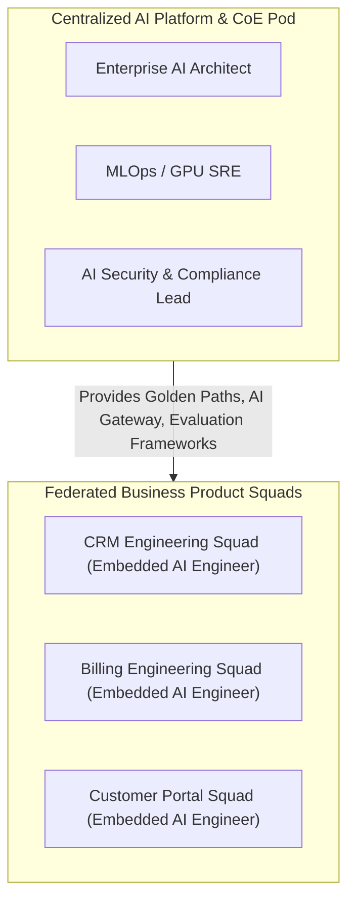

# Enterprise AI Operating Model & RACI Architecture

## 1. Operating Model Topologies

---

## 2. Enterprise RACI Matrix

| Activity | Product Management | Product Engineering | Central AI Platform | Information Security | Legal & Compliance |
| :--- | :---: | :---: | :---: | :---: | :---: |
| **Use-Case Intake & Feasibility** | **Accountable** | Responsible | Consulted | Consulted | Informed |
| **AI Gateway & Routing Infra** | Informed | Consulted | **Accountable** | Consulted | Informed |
| **Prompt Engineering & App Logic**| Consulted | **Accountable** | Consulted | Informed | Informed |
| **Prompt Injection Defense / Guardrails**| Informed | Responsible | Consulted | **Accountable** | Consulted |
| **Golden Dataset Evaluation Gating**| Consulted | **Accountable** | Responsible | Informed | Informed |
| **EU AI Act / Risk Classification**| Consulted | Informed | Consulted | Consulted | **Accountable** |
