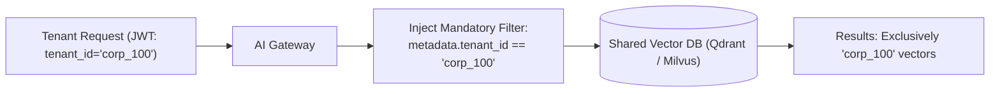

# Tenant Data Isolation in Shared Vector Databases

## 1. Enforcing Isolation at the Vector Engine Layer

### Invariant: Gateway-Enforced Filtering
The filter parameter must be injected by the authenticated server middleware; it is **never** accepted as an arbitrary parameter from client request payloads.
