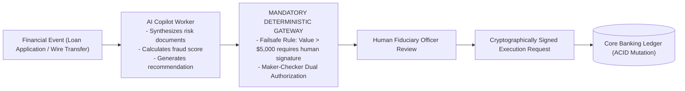

# AI in Financial Systems Architecture & Regulatory Boundaries

## 1. The Core Architectural Boundary: Recommendations vs. Execution

A foundational law of financial software architecture: **An AI model may recommend, analyze, or draft financial transactions; it must NEVER possess autonomous authority to sign, execute, or settle ledger mutations without deterministic controls**.

