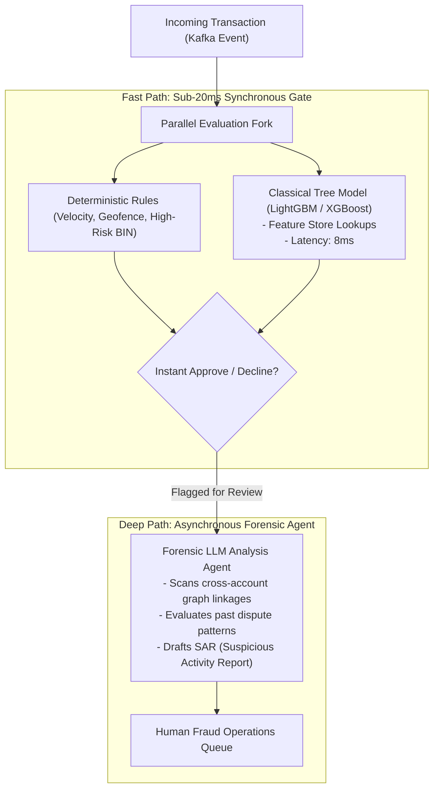

# Fraud Detection & Transaction Reconciliation AI

## 1. Dual-Speed Fraud Scoring Architecture

```mermaid
flowchart TD
    Tx["Incoming Transaction (Kafka Event)"] --> Split["Parallel Evaluation Fork"]
    
    subgraph FastPath ["Fast Path: Sub-20ms Synchronous Gate"]
        Split --> RuleEngine["Deterministic Rules (Velocity, Geofence, High-Risk BIN)"]
        Split --> MLModel["Classical Tree Model (LightGBM / XGBoost)\n- Feature Store Lookups\n- Latency: 8ms"]
        RuleEngine & MLModel --> FastGate{"Instant Approve / Decline?"}
    end

    subgraph DeepPath ["Deep Path: Asynchronous Forensic Agent"]
        FastGate -->|Flagged for Review| DeepAgent["Forensic LLM Analysis Agent\n- Scans cross-account graph linkages\n- Evaluates past dispute patterns\n- Drafts SAR (Suspicious Activity Report)"]
        DeepAgent --> Queue["Human Fraud Operations Queue"]
    end
```
