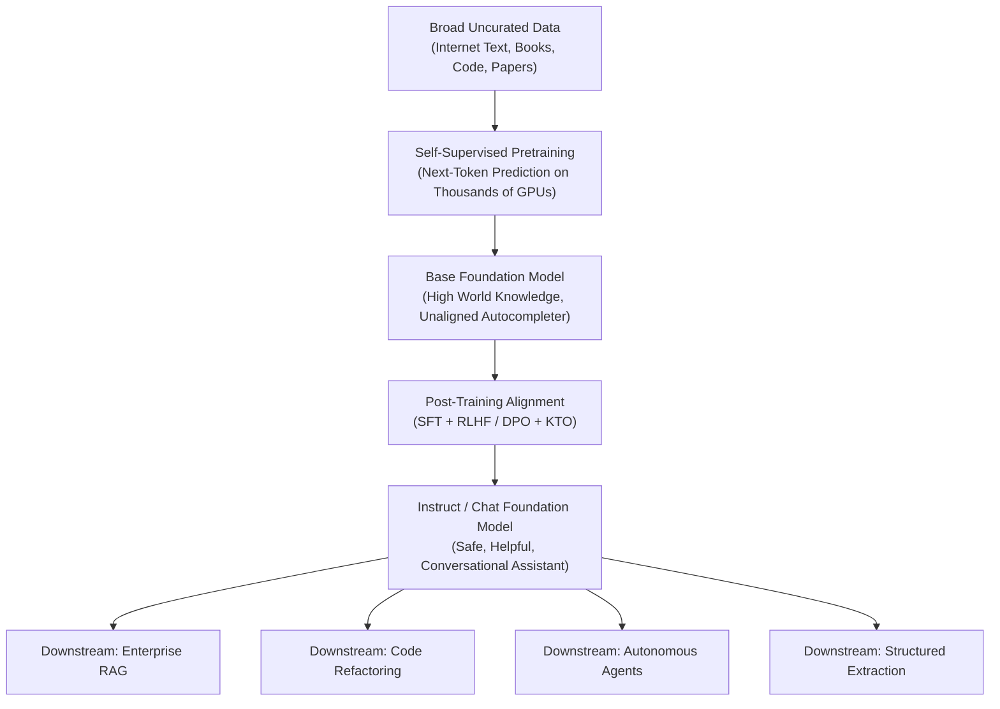

# Foundation Models Architecture & Capabilities

## 1. The Foundation Model Paradigm

A **Foundation Model** is a large-scale neural network trained on vast, broad unstructured data at scale (typically using self-supervised learning) that can be adapted to a wide range of downstream tasks without task-specific architectural redesign.

---

## 2. Empirical Scaling Laws (Chinchilla & Kaplan)
Architects must understand compute scaling laws to forecast model efficiency:
* **Compute-Optimal Training (Chinchilla Law)**: For optimal performance, model parameter count and training dataset token count must be scaled in equal proportion. For every doubling of model parameters, training tokens must also double.
* **Inference Efficiency**: A smaller model trained on more tokens (e.g., Llama-3-8B trained on 15T tokens) often outperforms older, larger models (e.g., Llama-1-65B trained on 1.4T tokens) while requiring $8\times$ less GPU VRAM during production serving.
