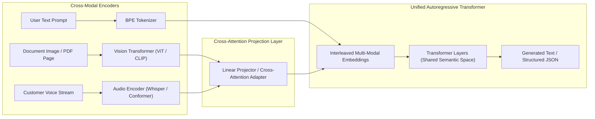

# Multimodal Models Architecture (Vision, Audio & Document AI)

## 1. Cross-Modal Fusion Topologies

Modern foundation models are increasingly multimodal, accepting interleaved text, high-resolution images, PDF page scans, and audio streams.

Enterprise systems leverage multimodal architectures to replace brittle OCR pipelines (Tesseract) with unified Vision-Language Models (VLMs) capable of understanding complex layouts, tables, and handwritten signatures simultaneously.

---

## 2. Architectural Trade-Offs: VLM vs Classical OCR Pipeline
* **Classical Pipeline (Tesseract + LayoutLM + Regex)**: Complex multi-step maintenance; fails when visual document layouts change; high engineering maintenance.
* **Unified Multimodal VLM (GPT-4o / Claude 3.5 Sonnet / Gemini 1.5)**: High zero-shot accuracy across multi-column tables, infographics, and scanned contracts; higher token cost ($Input Tokens = \text{Image Tiles} \times 256$); higher latency (1-3s).
