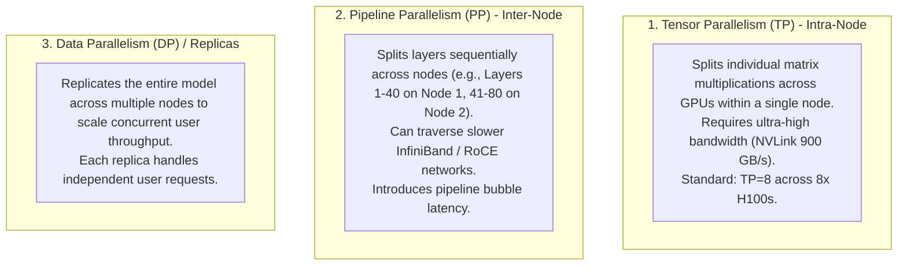

# Distributed GPU Parallelism: TP, PP & DP

## 1. Parallelism Taxonomy

When a foundation model exceeds the memory or compute capacity of a single GPU, it must be parallelized across multiple GPUs:

---

## 2. Production Recommendation
For standard enterprise serving (e.g., Llama-3-70B), deploy **Tensor Parallelism (TP = 8)** inside a single 8-GPU node. Scale out concurrent throughput by deploying multiple independent Data Parallel (DP) replicas behind the AI Gateway load balancer.
