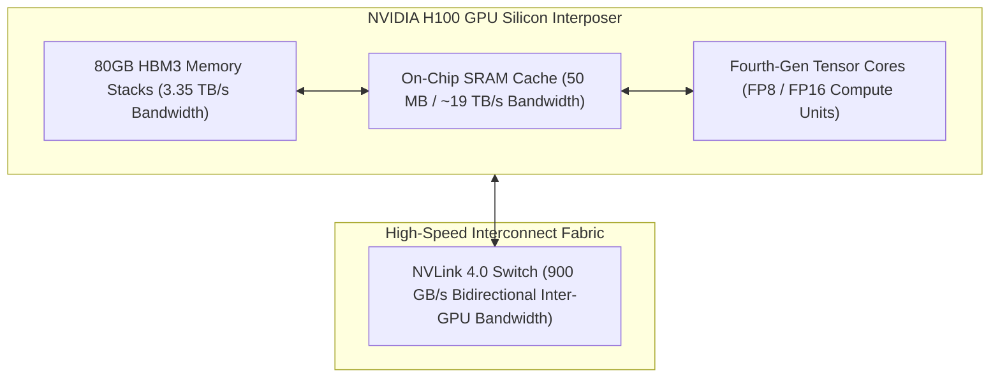

# GPU Hardware Architecture for Enterprise Architects

## 1. The GPU Memory Hierarchy

In traditional CPU servers, RAM is connected via a shared bus with memory bandwidth typically under $100\text{ GB/s}$. In AI workloads, autoregressive LLM decoding requires transferring entire model parameter weights from memory for every generated token.

High-end AI accelerators utilize **High-Bandwidth Memory (HBM3/HBM3e)** stacked directly on the silicon interposer, delivering up to **$3,350\text{ GB/s} - 8,000\text{ GB/s}$** of memory bandwidth.

---

## 2. Form Factor Invariants: SXM5 vs. PCIe
* **PCIe Form Factor**: Limited to 64 GB/s bi-directional PCIe Gen 5 host bandwidth. NVLink bridges are restricted to pairs of 2 GPUs. **Suitable only for single-GPU serving (e.g., 8B parameter models) or low-concurrency internal tools**.
* **SXM5 / NVLink Board**: 8 GPUs interconnected via a full crossbar NVLink switch backplane ($900\text{ GB/s}$). **Mandatory for Tensor Parallelism on 70B+ parameter models**.
