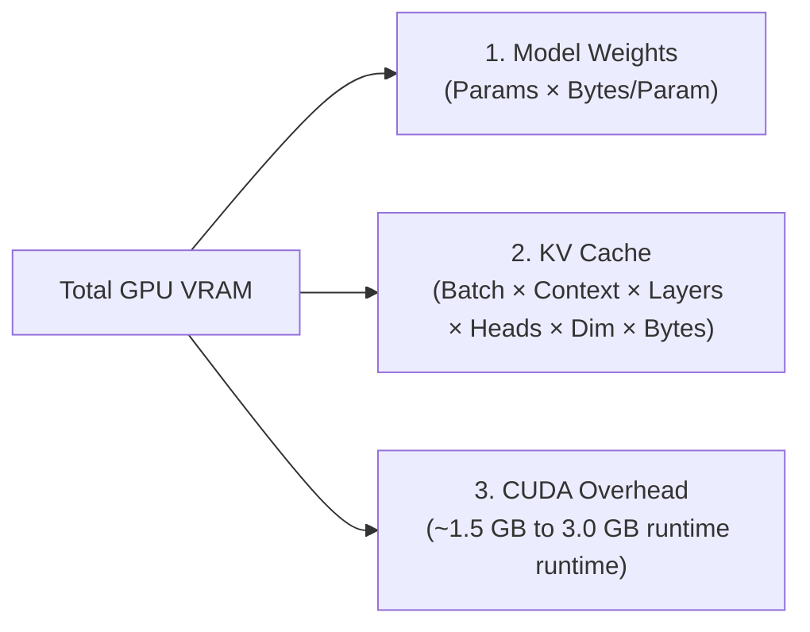

# VRAM Sizing & KV Cache Sizing Calculations

## 1. Total VRAM Requirement Formula

When provisioning GPU nodes, the total required VRAM is the sum of three distinct components:
$$\text{VRAM}_{\text{Total}} = \text{VRAM}_{\text{Weights}} + \text{VRAM}_{\text{KV\_Cache}} + \text{VRAM}_{\text{CUDA\_Overhead}}$$

---

## 2. Mathematical Calculations

### 2.1 Model Weight Sizing
$$\text{VRAM}_{\text{Weights}} = \text{Parameters (in Billions)} \times \text{Bytes per Parameter}$$
* For Llama-3-70B in FP16 (2 bytes): $70 \times 2 = 140\text{ GB}$.
* For Llama-3-70B in FP8 (1 byte): $70 \times 1 = 70\text{ GB}$.
* For Llama-3-70B in INT4 (0.5 bytes): $70 \times 0.5 = 35\text{ GB}$.

### 2.2 KV Cache Memory Formula (Per Concurrent Request)
For Grouped-Query Attention (GQA) models:
$$\text{KV\_Cache\_per\_Token} = 2 \times \text{Layers} \times \text{KV\_Heads} \times \text{Head\_Dimension} \times \text{Bytes\_per\_Value}$$
* For Llama-3-70B ($L=80, H_{kv}=8, D=128, \text{FP16}=2\text{ bytes}$):
  $$\text{KV per Token} = 2 \times 80 \times 8 \times 128 \times 2 = 327,680\text{ bytes} \approx 320\text{ KB per token}$$
* For a context of **4,096 tokens**:
  $$\text{KV Cache per Request} = 4,096 \times 320\text{ KB} \approx 1.31\text{ GB VRAM}$$
* **Sizing Concurrency**: If 8x H100 GPUs provide $640\text{ GB}$ total VRAM, and FP16 weights consume $140\text{ GB}$, the remaining $480\text{ GB}$ supports approximately:
  $$\text{Max Concurrent Requests} \approx \frac{480\text{ GB}}{1.31\text{ GB}} \approx 366\text{ concurrent users at 4k context}$$
