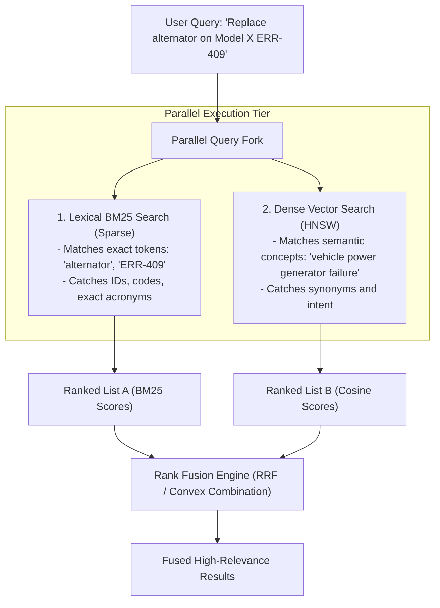

# Combining Dense & Sparse Search Architecture

## 1. The Hybrid Search Pipeline

---

## 2. Why Hybrid Search is Mandatory in the Enterprise
In a legal, financial, or engineering context, users constantly search with mixed queries: *"What does clause 4.2 say about indemnification liability?"*
* BM25 matches `"clause 4.2"` perfectly but fails on semantic variations of `"indemnification liability"`.
* Dense vector search understands the legal concept of liability but fails to locate `"clause 4.2"`.
* **Hybrid search retrieves the exact clause with 100% reliability**.
