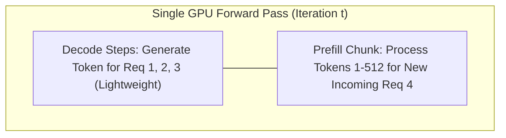

# Continuous Batching & Chunked Prefill Architecture

## 1. The Head-of-Line Blocking Problem

In traditional static batching, when Request A submits a massive 4,000-token prompt (prefill phase), all other concurrent requests are blocked from generating tokens for up to 500ms, causing severe latency jitter.

---

## 2. Chunked Prefill & Iteration Scheduling

**Chunked Prefill** breaks massive input prompt prefill computations into smaller, equal-sized chunks (e.g., 512 tokens), interleaving prompt processing with ongoing token decode steps:

### Result
Prevents time-to-first-token (TTFT) spikes and completely eliminates inference jitter under high multi-tenant concurrency.
