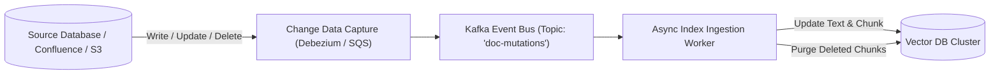

# Data Freshness & CDC Ingestion Pipelines

## 1. The Stale Index Vulnerability

Enterprise documents mutate constantly: customer contracts are amended, policy documents are updated, and user access privileges are revoked. A RAG system that relies on weekly batch re-indexing will serve **stale, incorrect, and legally hazardous information**.

---

## 2. Handling Deletions & GDPR Right-to-be-Forgotten
When a document or customer record is deleted from a source system, the CDC pipeline must immediately execute a hard-delete in the vector database matching the document's metadata (`metadata.doc_id == '123'`). Failing to purge deleted vectors violates data privacy regulations (GDPR/CCPA) and leaks historical records.
