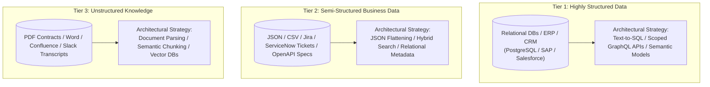

# Enterprise Knowledge Architecture

## 1. The 3 Tiers of Enterprise Knowledge

Enterprise knowledge exists across three distinct architectural layers, each requiring a specialized ingestion and representation strategy:

---

## 2. The Fallacy of "Vectorizing Everything"
A common enterprise anti-pattern is dumping relational database tables into a vector database. **Relational data must remain in relational databases**. If a user asks *"What was our total revenue in Q3 across the European division?"*, a vector search will hallucinate an answer. The correct architecture uses structured API tool calling (Text-to-SQL with strict schema guards) to query the relational database directly.
