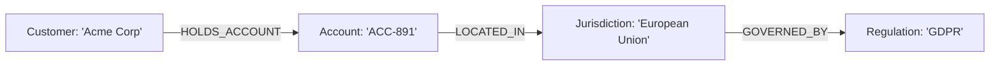

# Taxonomies, Ontologies & Knowledge Graphs

## 1. Structuring Enterprise Semantics

Unstructured text embeddings capture statistical co-occurrences of words, but they lack explicit, deterministic semantic relationships (*"Entity A is a subsidiary of Entity B, which is regulated by Authority C"*).

Integrating **Knowledge Graphs (Property Graphs / RDF Ontologies)** into the AI architecture provides deterministic relationship traversal.

---

## 2. Graph-Augmented RAG Retrieval
When a user asks: *"What data privacy rules apply to Acme Corp's primary account?"*
1. Extract the entity `"Acme Corp"` using named entity recognition (NER).
2. Traverse the Knowledge Graph to discover that Acme Corp holds `ACC-891`, located in the `EU`, governed by `GDPR`.
3. Query the vector database specifically for GDPR compliance policy documents, injecting the explicit relational graph path into the LLM context.
