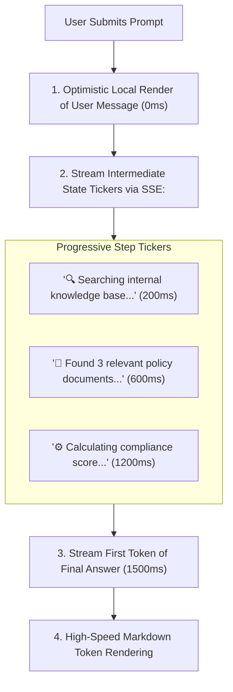

# Latency Masking & Perceived Performance Architecture

## 1. Managing User Perception during High-Latency Inference

When an agentic workflow or RAG pipeline takes $5\text{s} - 20\text{s}$ to retrieve documents, execute tools, and formulate an answer, a blank screen or static spinner causes user frustration and abandoned sessions.

Modern AI architecture incorporates **active perceptual latency masking**.

---

## 2. Architectural Invariants
* **Never Block on Background Operations**: If an operation does not impact the immediate answer (e.g., logging to observability store, updating user profile analytics), execute it asynchronously in the background via detached worker threads or event queues.
* **Typing Speed Smoothing**: Buffer fast GPU token bursts (e.g., 80 tps) and release them to the UI at a smoothed human-readable pace (30–40 tps) to prevent visual flickering.
