# LLM Application Design Patterns

## 1. The 4 Production Application Archetypes

Enterprise generative AI applications fall into four structural design archetypes:

```mermaid
flowchart TD
    subgraph Archetype1 ["1. Embedded Copilot"]
        UI1["User Interface (IDE / Document Editor)"] <--> Sidecar["AI Sidecar Assistant\n- Continuous context sync\n- Inline suggestions"]
    end
    subgraph Archetype2 ["2. Conversational Assistant"]
        UI2["Chat Interface"] <--> AgentCore["Stateful Conversation Agent\n- RAG retrieval\n- Multi-turn memory"]
    end
    subgraph Archetype3 ["3. Background Synthesizer"]
        Queue["Async Job Queue (Kafka)"] --> BatchProc["Batch AI Worker\n- Document summarization\n- Data extraction"]
    end
    subgraph Archetype4 ["4. Deterministic Transformation Filter"]
        API["Transactional API"] --> Filter["AI Parsing Filter\n- Natural language to SQL\n- Unstructured to JSON"]
    end
```

---

## 2. Pattern Selection Matrix

| Pattern | User Interactivity | Latency Sensitivity | Statefulness | Primary Risk |
| :--- | :--- | :--- | :--- | :--- |
| **Embedded Copilot** | Continuous | Ultra-high (< 300ms) | Ephemeral document state | Editor latency jank |
| **Conversational Assistant** | Multi-turn | High (TTFT < 800ms) | Persistent session memory | Context window overflow |
| **Background Synthesizer** | None (Async) | Low (Minutes/Hours) | Stateless per document | Token cost runaway |
| **Transformation Filter** | Transactional | High (< 1000ms) | Stateless | Malformed JSON schema |
