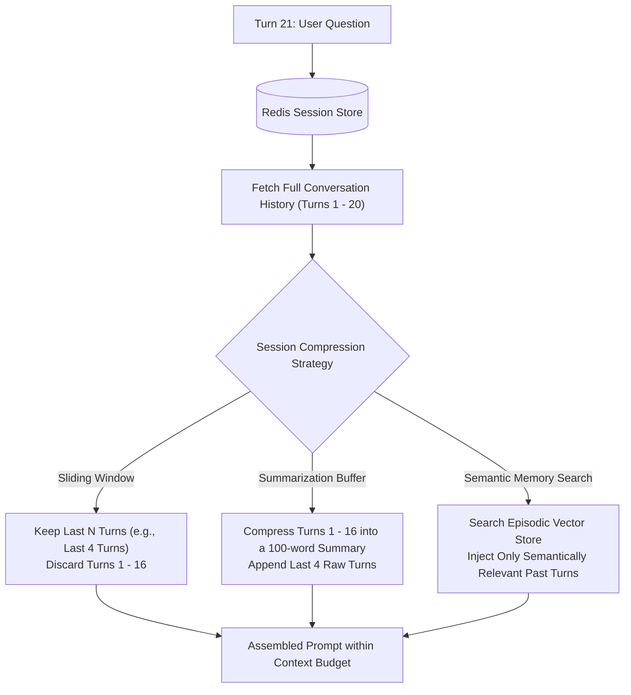

# State Management & Conversation Session Architecture

## 1. The Context Window Expansion Trap

As a conversation progresses, naive applications append every user prompt and assistant response to the request payload. In a 20-turn conversation, passing the full uncompressed conversation history results in **quadratic token cost inflation and attention degradation ("lost in the middle")**.

---

## 2. Architectural Session Store Topology
* **Fast In-Memory Layer (Redis Cluster)**: Stores active conversation threads with a 24-hour TTL. Sub-millisecond read/write latency ensures zero overhead on token streaming.
* **Cold Persistence Layer (PostgreSQL / DynamoDB)**: Asynchronously stores full unredacted conversation transcripts for auditing, compliance, and offline model evaluation.
