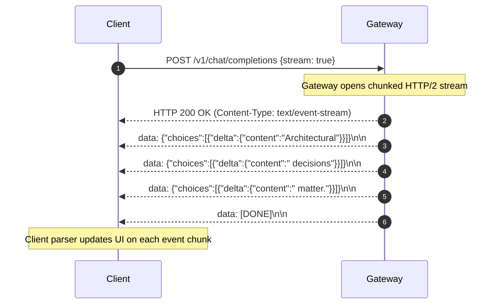

# Streaming Tokens Architecture (SSE & WebSockets)

## 1. Server-Sent Events (SSE) Protocol Deep-Dive

Because generating a 500-word response takes $5\text{s} - 15\text{s}$, waiting for the complete HTTP response body results in a perceived freeze.

Streaming tokens using standard **Server-Sent Events (SSE)** provides immediate interactivity (TTFT < 800ms) while avoiding the bidirectional connection overhead of WebSockets.

---

## 2. Critical Edge & Gateway Streaming Considerations
1. **Disable Proxy Buffering**: Nginx, Cloudflare, and AWS ALB must be configured with `X-Accel-Buffering: no` or buffering disabled; otherwise, proxies will buffer tokens until 4KB is accumulated, destroying the streaming user experience.
2. **HTTP/2 Connection Multiplexing**: Mandate HTTP/2 to prevent browser connection starvation (HTTP/1.1 limits browsers to 6 concurrent connections per domain).
