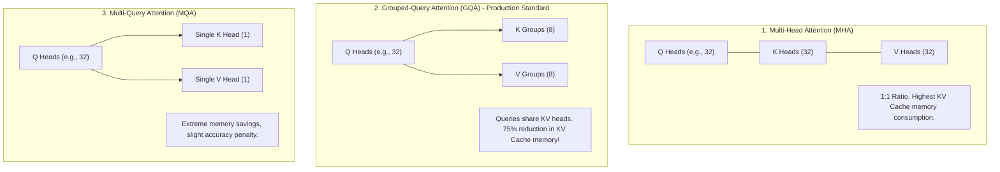

# Attention Mechanisms & Memory Scaling (MHA, GQA & FlashAttention)

## 1. The Attention Bottleneck: $O(N^2)$ Complexity

Standard Multi-Head Attention (MHA) computes attention scores between every pair of tokens in a sequence:
$$\text{Attention}(Q, K, V) = \text{softmax}\left(\frac{QK^T}{\sqrt{d_k}}\right)V$$
For a sequence of length $N$, computing $QK^T$ requires $O(N^2)$ computational operations and $O(N^2)$ memory storage. For long context windows ($N \ge 32\text{k}$), naive attention completely exhausts GPU memory.

---

## 2. Memory-Optimized Attention Topologies

### 2.3 FlashAttention (IO-Aware Exact Attention)
* Traditional PyTorch attention writes intermediate $N \times N$ attention matrices to slow GPU High-Bandwidth Memory (HBM).
* **FlashAttention** tiles attention computation into blocks that fit entirely within ultra-fast on-chip SRAM cache ($19\text{ TB/s}$ bandwidth), computing softmax incrementally without ever writing the massive $N \times N$ matrix to HBM.
* **Result**: $3\times - 5\times$ speedup with exact mathematical parity.
