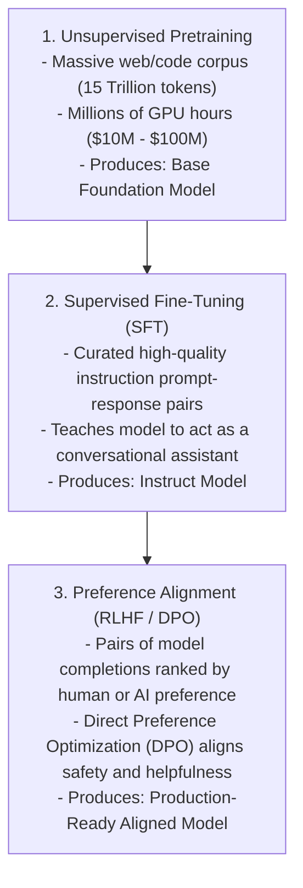

# Pretraining, Fine-Tuning & Alignment (RLHF / DPO)

## 1. The 3-Tier Post-Training Pipeline

Deploying an LLM involves three progressive training tiers:

---

## 2. Architectural Decision: Fine-Tuning vs. RAG

A frequent architectural anti-pattern is attempting to "teach" an LLM new private enterprise facts via fine-tuning. 
* **Fine-Tuning is for Style, Format, and Tone**: Teach a model domain-specific syntax, specialized output schemas, or conversational voice.
* **RAG is for Knowledge, Facts, and Dynamic Data**: Inject real-time account balances, internal product documentation, and tenant-scoped records.
* **Rule**: *Never fine-tune a model to memorize facts that change frequently.*
