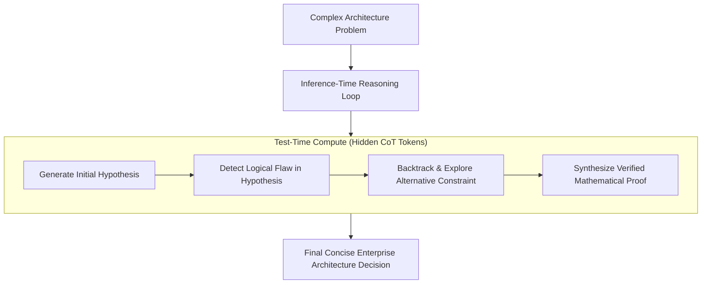

# Reasoning Models & Test-Time Compute Scaling

## 1. The Shift to Inference-Time Compute

Historical model improvement relied on pretraining scaling (more parameters, more training tokens). Modern **Reasoning Models** (OpenAI o1, DeepSeek-R1) introduce a new scaling frontier: **Test-Time Compute Scaling**.

Instead of emitting an answer immediately on the first token pass, reasoning models generate hundreds or thousands of internal "hidden thoughts" (Chain-of-Thought tokens), backtracking, self-correcting, and exploring alternative logical paths before presenting the final response.

---

## 2. Systems Architectural Implications

1. **Massive Latency Inflation**: Reasoning models take $10\text{s} - 60\text{s}$ to return responses. They cannot be used for synchronous real-time user-facing chatbots with sub-second SLAs.
2. **Token Bill Escalation**: A user prompt asking a 10-word question may trigger 4,000 hidden reasoning tokens billed at premium output token rates.
3. **Asynchronous Architecture Mandate**: Reasoning models must be encapsulated within asynchronous job queues (Celery, BullMQ, Kafka) with polling or webhook delivery.
