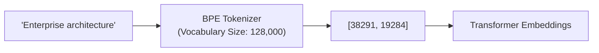

# Tokens & Tokenization Internals for System Architects

## 1. Tokenization Mechanics & Byte-Pair Encoding (BPE)

LLMs do not process words, characters, or bytes directly; they process discrete integer IDs representing subword fragments called **Tokens**, generated by a **Byte-Pair Encoding (BPE)** tokenizer (e.g., Tiktoken, SentencePiece).

---

## 2. Architectural Invariants & Pitfalls

### 2.1 Language and Multilingual Tax
In English, $100\text{ words} \approx 130\text{ tokens}$ ($1.3\text{ tokens/word}$). In non-Latin languages (e.g., Arabic, Hindi, Japanese) or heavily indented code (Python/JSON), poor tokenization vocabulary representation can result in $3\times - 6\times$ more tokens for the exact same semantic content, multiplying latency and cloud API costs.

### 2.2 Whitespace and Code Indentation
Leading whitespace and tab characters are tokenized differently depending on clustering. Ingestion chunkers must preserve exact spacing without inflating unnecessary single-space tokens.
