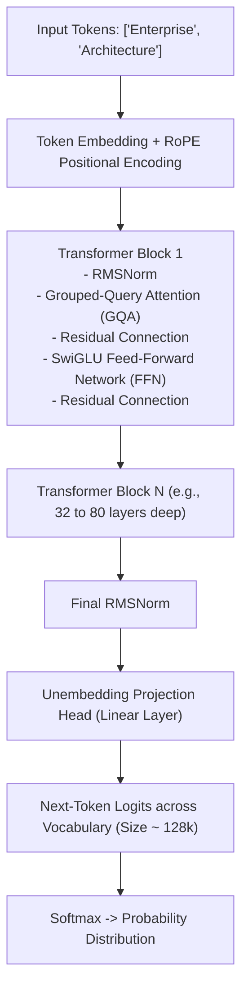

# Transformer Architecture for Systems Architects

## 1. The Decoder-Only Dominance

While early transformer architectures (e.g., original Vaswani et al., T5) utilized an Encoder-Decoder structure, modern generative foundation models (GPT-4, Llama, Claude, Mistral) have converged almost universally on **Decoder-Only Autoregressive Architectures**.

---

## 2. Key Architectural Invariants
* **Causal Masking**: Ensures token $t$ can only attend to previous tokens $1 \dots t-1$, preventing the model from seeing future tokens during autoregressive decoding.
* **Rotary Position Embedding (RoPE)**: Encodes relative position between tokens geometrically via complex rotation matrices, enabling extrapolation to long context windows (128k+ tokens) without catastrophic degradation.
