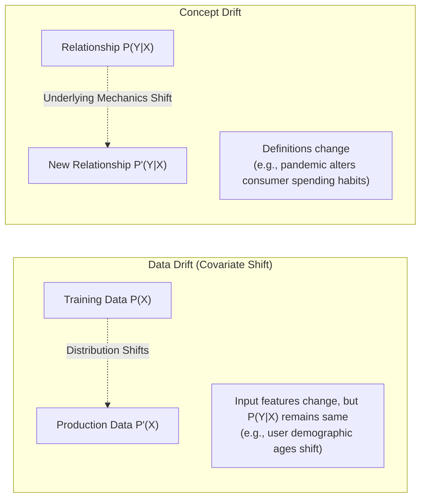

# Data & Concept Drift Monitoring Architecture

## 1. The Reality of Production Degradation

In traditional software, code behaves identically over time unless bugs exist or external dependencies break. In machine learning, **models begin degrading the moment they are deployed to production** because the real-world data distribution inevitably shifts away from the training distribution.

---

## 2. Detection Methodologies & Metrics

### 2.1 Statistical Distance Metrics (Data Drift)
* **Population Stability Index (PSI)**: Quantifies the divergence between training and inference distributions.
  * $\text{PSI} < 0.1$: No significant change.
  * $0.1 \le \text{PSI} < 0.25$: Moderate drift; warning triggered.
  * $\text{PSI} \ge 0.25$: Severe drift; automated retraining or fallback required.
* **Kolmogorov-Smirnov (K-S) Test & Wasserstein Distance**: Non-parametric tests for continuous numerical features.

### 2.2 Performance Drift (Ground-Truth Tracking)
* In systems with immediate ground truth (e.g., e-commerce click-through rate, search ranking), monitor rolling AUC, Precision, and Recall in real time.
* In delayed ground-truth systems (e.g., loan default prediction taking 12 months), rely on proxy data drift indicators.

---

## 3. Automated Remediation Architecture

When drift crosses critical thresholds:
1. Trigger automated PagerDuty/Slack notification to the MLOps engineering rotation.
2. Spin up ephemeral Ray/Kubeflow training clusters with the latest 30-day window of curated production data.
3. Automatically evaluate the retrained candidate model against the active production model on holdout sets.
4. Promote the new model version via canary deployment (10% $\to$ 50% $\to$ 100%) if validation passes.
