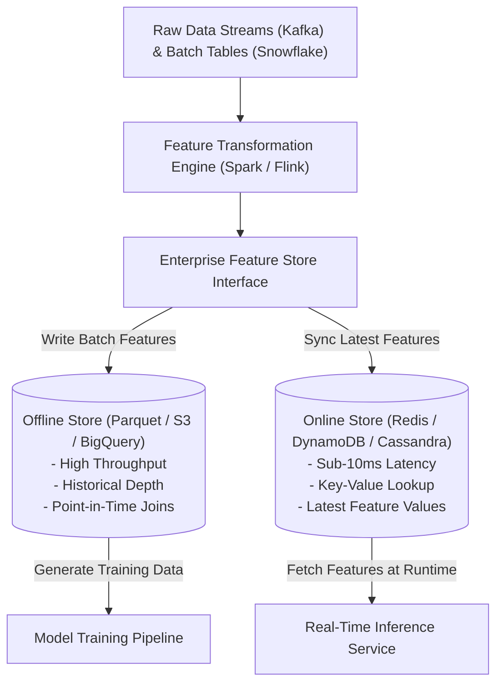

# Feature Engineering & Feature Stores Architecture

## 1. The Core Architectural Problem: Training-Serving Skew

In traditional machine learning implementations, data scientists compute features in Python notebooks using batch SQL queries, while software engineers rewrite feature extraction logic in Java or C# for low-latency production APIs.

This inevitably leads to **training-serving skew**: subtle differences in numerical calculations, time-window alignments, or null handling that silently degrade production model accuracy.

---

## 2. The Feature Store Architecture

A Feature Store (e.g., Feast, Hopsworks, AWS SageMaker Feature Store) provides a single, unified abstraction over two distinct storage engines:

---

## 3. Key Feature Store Invariants

1. **Point-in-Time Correctness ("Time Travel")**: When constructing training datasets, the feature store must only join feature values that were known *prior* to the observation timestamp, preventing data leakage from the future.
2. **Sub-10ms P99 Online Retrieval**: The online store must serve multi-feature vectors by entity ID (e.g., `user_id`, `merchant_id`) with strict latency bounds to avoid bottlenecking transactional user flows.
3. **Single Source of Truth**: Feature transformation logic is declared once as code and executed consistently across both streaming and batch contexts.
