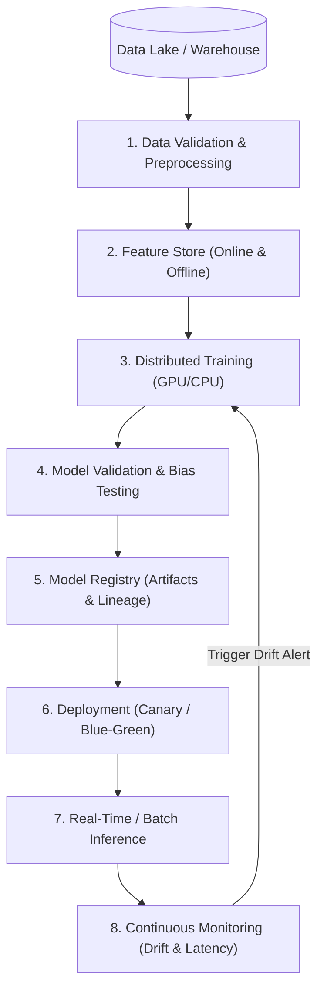

# The Enterprise Machine Learning Pipeline Lifecycle

## 1. Lifecycle Architecture

---

## 2. Core Architectural Stages

### 1. Data Validation & Preprocessing
* Enforce data schema contracts (Great Expectations, Pandera) on raw ingestion.
* Detect missing values, schema mutations, and out-of-range anomalies before training begins.

### 2. Feature Engineering & Feature Stores
* Eliminate training-serving skew by using unified feature definitions across batch training and low-latency inference.

### 3. Distributed Training & Hyperparameter Tuning
* Orchestrated via Kubeflow, Ray, or AWS SageMaker. Checkpointing state to object storage (S3/GCS) ensures fault tolerance.

### 4. Validation & Bias Audit
* Automated evaluation against holdout test datasets across business metrics (F1-score, AUC-ROC, Precision/Recall) and ethical fairness metrics across demographic cohorts.

### 5. Model Registry
* Centralized repository (MLflow, Vertex Model Registry) storing serialized model weights (ONNX, PyTorch), software environment containers, and data lineage hashes.

### 6. Deployment & Serving
* Packaged in optimized runtime containers (Triton Inference Server, TorchServe, FastAPI) deployed to Kubernetes clusters with HPA autoscaling.

### 7. Continuous Monitoring
* Real-time extraction of prediction distributions and ground-truth feedback to trigger automated retraining pipelines.
