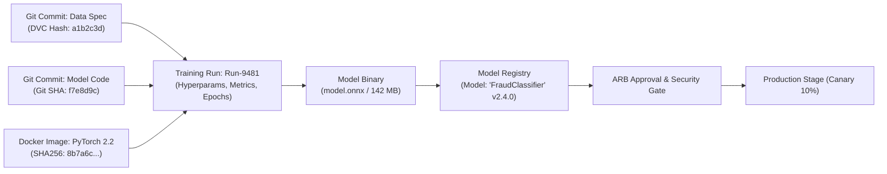

# Model Registry & Artifact Lineage Architecture

## 1. Executive Summary

A Machine Learning model is not just code; it is the product of three distinct inputs: **Code (Algorithms) + Data (Training Set) + Compute (Hyperparameters & Environment)**.

A **Model Registry** serves as the single source of truth for tracking, managing, and governing model artifacts throughout their entire lifecycle from experimentation to production retirement.

---

## 2. Model Lineage Graph

---

## 3. Architectural Invariants for Model Registries

1. **Immutable Artifacts**: Once a model version is registered, its binary weights and configuration files must be marked read-only and backed by cryptographic SHA256 checksums.
2. **Deterministic Reproducibility**: Given a model version, the registry must provide the exact Git commit, training dataset snapshot ID, and Docker base image digest used to produce it.
3. **Stage Transition Governance**: Transitioning a model from `Staging` to `Production` must enforce automated checks:
   * Validation metrics meet or exceed baseline.
   * Model passes adversarial vulnerability and bias testing.
   * Model latency and memory consumption satisfy production NFRs.
