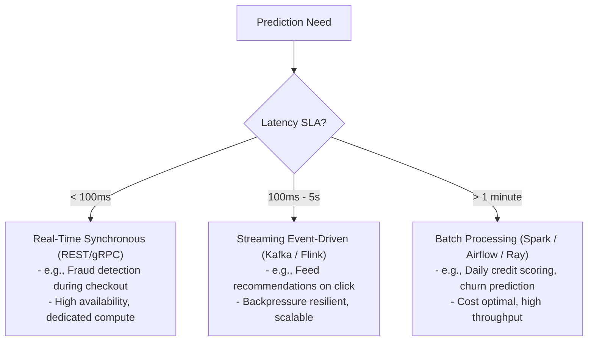

# Real-Time vs. Batch Inference Architecture

## 1. Architectural Trade-Off Analysis

Choosing between real-time (synchronous) inference, streaming (event-driven) inference, and batch (asynchronous) scoring is one of the most critical architectural decisions in machine learning system design.

---

## 2. Deep Comparative Matrix

| Dimension | Real-Time (Synchronous) | Streaming (Event-Driven) | Batch (Asynchronous) |
| :--- | :--- | :--- | :--- |
| **Protocol / Ingestion** | HTTP/2, gRPC, direct socket. | Apache Kafka, AWS Kinesis, RabbitMQ. | Object storage (S3/GCS), Snowflake, BigQuery. |
| **Latency SLA** | 5ms – 100ms | 100ms – 2,000ms | Minutes to hours. |
| **Throughput (QPS)** | 100 – 50,000 QPS | 1,000 – 500,000 events/sec | Millions of rows per batch run. |
| **Compute Sizing** | Scaled for peak load + headroom; autoscaled with HPA. | Scaled to keep consumer lag near zero. | Scaled via ephemeral spot instances; terminated when job completes. |
| **Cost Profile** | Highest cost per inference (idle GPU/CPU capacity). | Medium cost; amortized across event batches. | Lowest cost per inference (dense batching, spot compute). |
| **Failure Mode** | Client timeout, HTTP 504, user-facing degradation. | Consumer lag buildup, dead-letter queues. | Job failure, delayed batch delivery, pipeline retry. |

---

## 3. Architectural Recommendation: The Hybrid Pattern
For systems like recommendation engines or customer portals, precompute batch predictions for 90% of common queries during off-peak hours and store them in an in-memory cache (Redis). Fall back to real-time synchronous inference only when a cache miss occurs (e.g., for new or highly active users).
