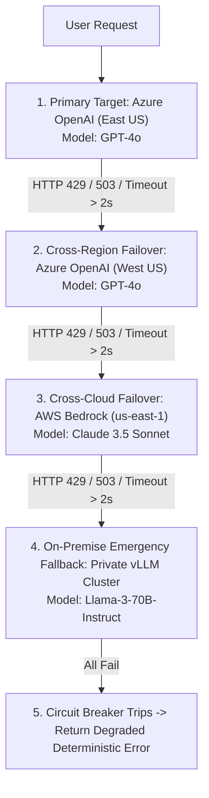

# Cascade & Fallback Routing Architecture

## 1. The Fallback Cascade Topology

Cloud foundation model APIs regularly experience rate limit spikes (HTTP 429) or regional service degradations (HTTP 503). An enterprise cannot allow an external cloud vendor's outage to halt internal business operations.

---

## 2. Architectural Invariants
1. **Sub-150ms Switchover**: Gateway failover between providers must occur within 150ms upon receiving a 429 or 5xx error.
2. **Idempotency Key Preservation**: When retrying a failed request against a fallback provider, preserve the original transaction idempotency key to prevent duplicate billing or side effects.
