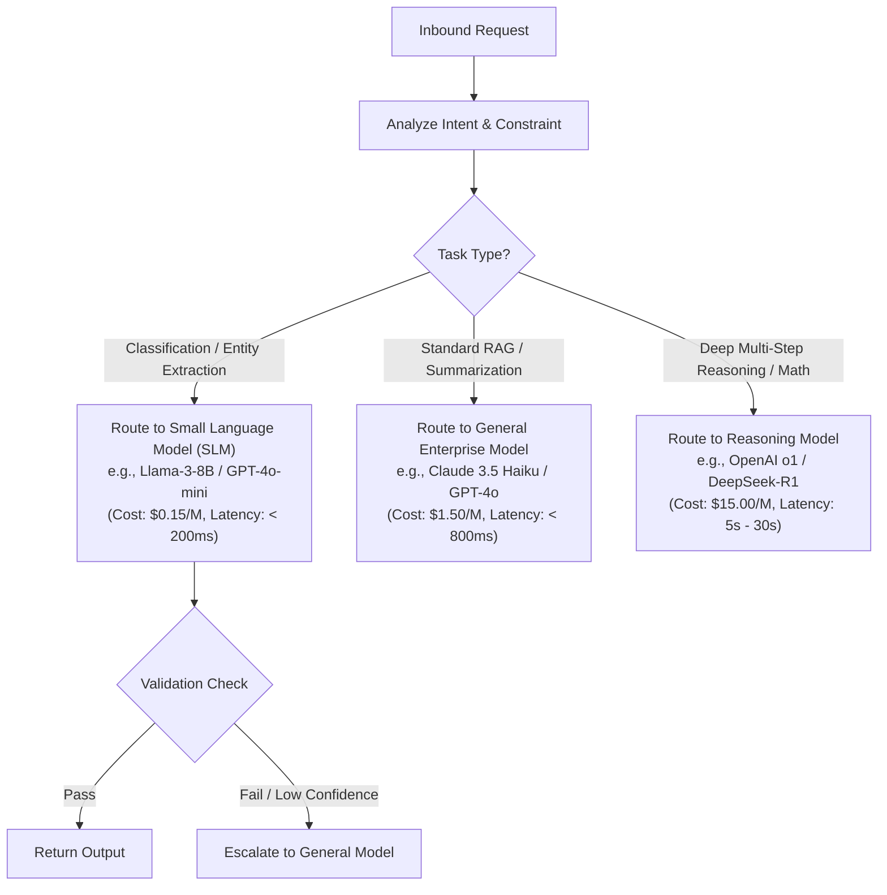

# Model Routing Decision Framework

## 1. Decision Criteria & Trade-Off Matrix

---

## 2. Multi-Dimensional Routing Scorecard

| Dimension | Tier 1: SLM (< 10B) | Tier 2: General (70B) | Tier 3: Reasoning Frontier |
| :--- | :--- | :--- | :--- |
| **P99 Latency Target** | $< 250\text{ms}$ | $< 1,200\text{ms}$ | $10\text{s} - 45\text{s}$ |
| **Relative Cost per 1k Tokens** | $0.05\times$ | $1.0\times$ (Baseline) | $10.0\times$ |
| **JSON Schema Conformance** | $92\%$ | $99.2\%$ | $99.8\%$ |
| **Complex Logic / Code Synthesis** | Poor | Strong | Industry Leading |
| **Recommended Routing Share** | $\sim 65\%$ of enterprise traffic | $\sim 30\%$ of enterprise traffic | $\sim 5\%$ of enterprise traffic |
