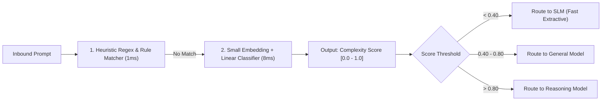

# Task Complexity Classifiers & Intent Recognition

## 1. The Architecture of Routing Classifiers

To route requests dynamically without adding unacceptable latency, the **Classifier** must execute in **$< 15\text{ms}$**. Invoking a secondary LLM to decide which LLM to route to is an architectural anti-pattern that doubles latency.

---

## 2. Classifier Implementations
* **Regex / Heuristic Matching (1ms)**: Detects structured commands, keywords, or short prompts ($< 15\text{ words}$) that are known simple queries.
* **Logistic Regression over Embeddings (8ms)**: Computes a fast embedding (e.g., `text-embedding-3-small` or local ONNX MiniLM) and runs a single matrix multiplication against pre-trained logistic regression weights to classify complexity.
