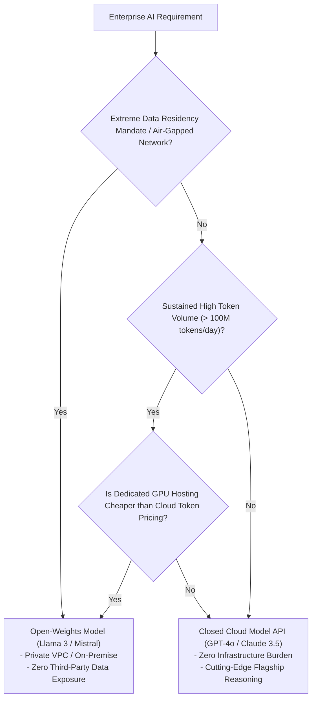

# Open-Weights vs. Closed Proprietary Models

## 1. The Core Architectural Dilemma

A central architectural decision in enterprise AI strategy is whether to adopt closed proprietary foundation model APIs (OpenAI, Anthropic, Google) or deploy open-weights models (Meta Llama 3, Mistral, Qwen) on private enterprise infrastructure.

---

## 2. Comparative Trade-Off Matrix

| Dimension | Closed Proprietary APIs (OpenAI, Anthropic, Google) | Open-Weights Models (Llama 3, Mistral, Qwen) |
| :--- | :--- | :--- |
| **State-of-the-Art Reasoning** | Leading frontier capabilities; first to launch advanced features. | Approaching parity; typically 3–6 months behind frontier reasoning models. |
| **Infrastructure Overhead** | Zero. Pure serverless API consumption. | High. Requires provisioning, autoscaling, and monitoring GPU clusters. |
| **Data Privacy & Control** | Dependent on vendor contractual commitments (Zero Data Retention). | Absolute. Data never leaves private enterprise VPC; completely air-gapped capable. |
| **Customizability** | Limited to prompt engineering and lightweight LoRA fine-tuning. | Complete. Full access to model weights, custom architectures, and full fine-tuning. |
| **Availability & Outages** | Subject to external provider downtimes, outages, and regional API throttling. | Governed entirely by internal enterprise Kubernetes SLAs and multi-AZ failover. |
