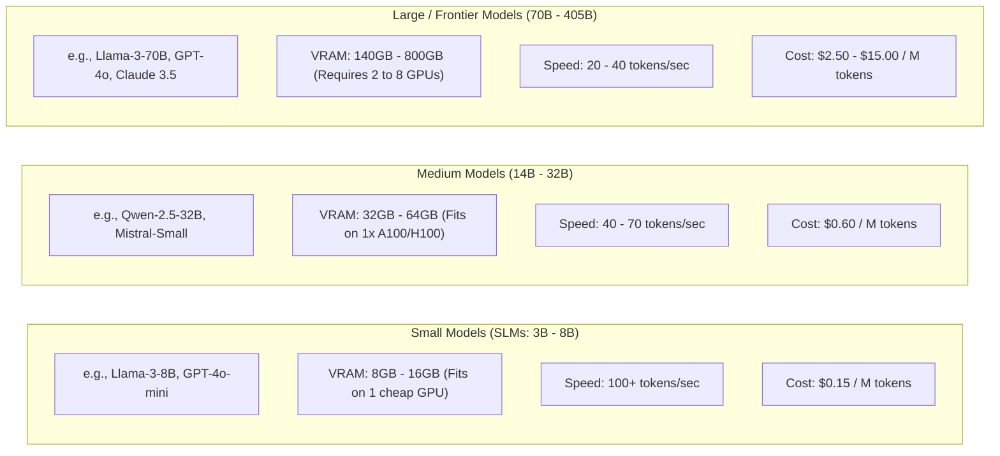

# Model Parameter Scale & Efficiency Trade-Offs

## 1. Sizing the Model to the Task

A common architectural anti-pattern is deploying massive 70B+ parameter models for simple classification, routing, or extraction tasks.

Foundation models fall into three distinct parameter tiers, each offering a distinct trade-off between reasoning depth, inference latency, and infrastructure cost:

---

## 2. Assignment Guidelines
* **Use Small Language Models (SLMs)** for: Intent classification, entity extraction, sentiment analysis, query rewriting, spell checking, and PII masking.
* **Use Medium Models** for: Standard RAG question-answering, document summarization, draft email synthesis, and conversational customer support.
* **Use Large / Frontier Models** for: Complex multi-step reasoning, mathematical problem solving, automated architectural code generation, and ambiguous strategic analysis.
