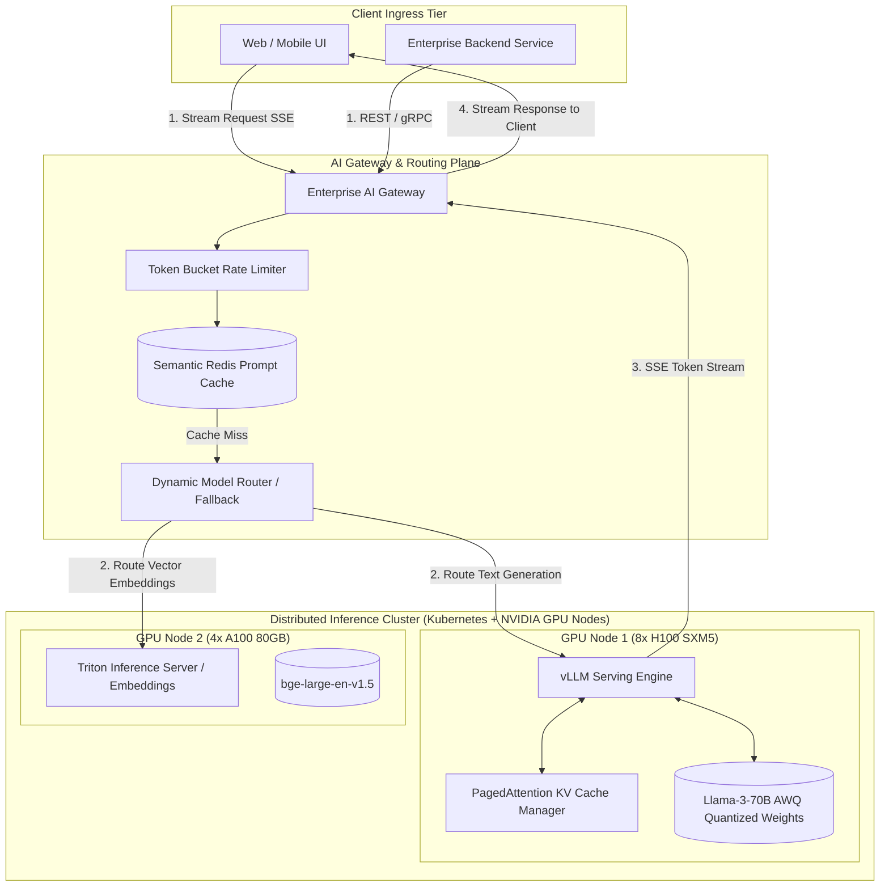

# AI Model Serving Architecture: vLLM, PagedAttention, Quantization, and Inference Optimization

## 1. Architectural Overview & Context
**AI Model Serving** governs the hosting, acceleration, scheduling, and scaling of machine learning models and Large Language Models (LLMs) in production.

Unlike traditional stateless REST microservices where CPU and RAM scale linearly with request volume, LLM inference is fundamentally **memory-bandwidth bound and GPU VRAM constrained**:
> **The GPU Memory Reality**:
> *Serving a 70-billion parameter model (Llama-3-70B) in FP16 requires 140 GB of GPU VRAM purely to load model weights—before allocating a single byte for user request contexts (KV Cache). Architectural optimization determines whether a cluster costs $50,000/month or $5,000/month.*

```
┌─────────────────────────────────────────────────────────────────────────────┐
│                       THE INFERENCE LATENCY PIPELINE                        │
├─────────────────────────────────────────────────────────────────────────────┤
│ User Prompt ──► [Pre-fill Phase / Prompt Processing (Compute Bound)]        │
│                       ├── Computes initial KV cache for all prompt tokens   │
│                       └── Emits First Token (Time-To-First-Token - TTFT)    │
│                                                                             │
│ Generated Tokens ──► [Decode Phase / Auto-regressive Generation (Memory Bound│
│                       ├── Generates 1 token per forward pass iteratively    │
│                       └── Governed by Inter-Token Latency (ITL, tokens/sec) │
└─────────────────────────────────────────────────────────────────────────────┘
```

---

## 2. End-to-End Enterprise Model Serving Topology



---

## 3. GPU Memory Optimization: PagedAttention & The KV Cache

In auto-regressive transformers, previous token attention states must be cached in GPU VRAM (the **Key-Value / KV Cache**) to avoid recomputing attention history at every new token generation step.

### The Problem with Naive Allocation:
Traditional inference frameworks allocate contiguous physical VRAM for the maximum possible context length ($8192$ tokens). This resulted in **$60\% - 80\%$ of GPU memory wasted** on internal/external fragmentation.

### The vLLM PagedAttention Breakthrough:
Inspired by virtual memory paging in operating systems, **PagedAttention** partitions the KV cache into fixed-size virtual blocks (e.g. 16 tokens per block) mapped dynamically to non-contiguous physical GPU VRAM pages:

```
Virtual Memory Tokens: [T0..T15]  [T16..T31]  [T32..T47]
                             │          │           │
                             ▼          ▼           ▼
Physical GPU Memory Pages: [Page 4]   [Page 9]   [Page 1] (Scattered anywhere in VRAM!)
```
* **Architectural Impact**: Eliminates VRAM waste, enabling **$2\times - 4\times$ higher concurrent batch throughput** on the exact same GPU hardware!

---

## 4. Continuous Batching vs. Static Micro-Batching

```
Static Micro-Batching (Wasteful Padding)          Continuous Dynamic Batching (High Throughput)
┌───────────────────────────────────────┐         ┌───────────────────────────────────────┐
│ Req 1: "Hi" (2 tokens) [PAD PAD PAD]  │         │ Req 1 finishes at t=2; immediately   │
│ Req 2: 500-token essay                │  ──►───►│ eject from batch. Insert incoming     │
│ GPU waits idle for Req 2 to finish    │         │ Req 3 into available slot at t=3!     │
│ before evicting batch!                │         │ Zero GPU idle cycles or wasted padding│
└───────────────────────────────────────┘         └───────────────────────────────────────┘
```

---

## 5. Model Quantization: FP16 vs. AWQ vs. GPTQ vs. GGUF

Quantization reduces the precision of model weights from 16-bit floating point to 8-bit or 4-bit integers, drastically reducing VRAM requirements with negligible quality degradation:

| Quantization Format | Weight Precision | Typical Model Size (70B) | Memory Bandwidth Gain | Preferred Production Context |
|---|---|---|---|---|
| **FP16 (Unquantized)** | 16-bit float | $\approx 140\text{ GB}$ (Requires 2x 80GB GPUs) | Baseline ($1.0\times$) | Maximum precision; benchmark evaluations |
| **AWQ (Activation-aware)**| 4-bit integer | $\approx 38\text{ GB}$ (Fits on single 48GB GPU!)| **$2.5\times - 3.2\times$ faster decode** | **Production standard** for high-throughput vLLM serving |
| **GPTQ** | 4-bit integer | $\approx 38\text{ GB}$ | $2.2\times - 2.8\times$ faster decode | Offline batch processing |
| **GGUF (llama.cpp)** | 4-bit / 8-bit | $\approx 38\text{ GB} - 70\text{ GB}$ | CPU/GPU unified memory | Edge devices, Mac Studio / Apple Silicon, local laptops |

---

## 6. Inference Telemetry & Latency Budgets

Model serving observability tracks three distinct metrics:

```
┌─────────────────────────────────────────────────────────────────────────────┐
│                        MODEL INFERENCE METRICS (SLIs)                       │
├─────────────────────┬───────────────────────────────────────────────────────┤
│ TTFT                │ Time To First Token: Time from request arrival to the │
│ (Target: < 500ms)   │ first generated token streaming back to user.         │
├─────────────────────┼───────────────────────────────────────────────────────┤
│ ITL                 │ Inter-Token Latency: Time between subsequent streamed │
│ (Target: < 30ms/tok)│ tokens (governs reading comfort; 30ms = 33 tokens/sec)│
├─────────────────────┼───────────────────────────────────────────────────────┤
│ Total Latency       │ $\text{Total Latency} = \text{TTFT} + (N_{\text{tokens}} \times \text{ITL})$ │
└─────────────────────┴───────────────────────────────────────────────────────┘
```

---

## 7. Model Serving Architectural Checklist
- [ ] Adopt **vLLM** or **Triton Inference Server** with PagedAttention and continuous batching.
- [ ] Quantize production models to **4-bit AWQ** to fit within cost-effective GPU tiers (e.g. single A100/H100).
- [ ] Implement Server-Sent Events (SSE) streaming on all interactive UI endpoints to minimize perceived TTFT.
- [ ] Implement semantic prompt caching at the AI Gateway to bypass inference on repetitive queries.
- [ ] Configure autoscaling based on **KV Cache Memory Usage** rather than CPU utilization.
- [ ] Monitor TTFT, ITL, and Token Generation Rate in OpenTelemetry dashboards.

---

## 8. Related Modules
* [01-architecture/ai-architecture/](../../01-architecture/ai-architecture/README.md) — Enterprise AI architecture, RAG pipelines, and agentic workflows.
* [11-observability/](../../11-observability/) — Distributed tracing and Prometheus GPU metrics.
* [08-cloud/cloud-cost-optimization/](../../08-cloud/cloud-cost-optimization/README.md) — GPU compute reservation economics.
