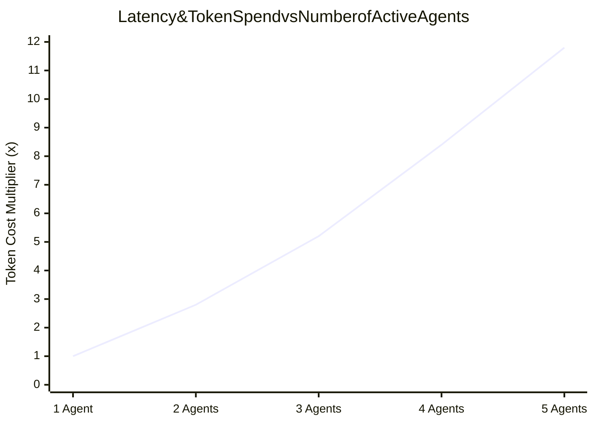

# Multi-Agent Coordination Overhead & Cost Economics

## 1. The Token Amplification Factor

In a single-agent system, an action requires 1 LLM forward pass. In a 4-agent system, a single task typically triggers:
$$\text{Total Calls} = \text{Supervisor Plan} + \sum_{i=1}^4 \text{Specialist Actions} + \text{Critique Passes} + \text{Supervisor Synthesis} \approx 8 - 15 \text{ LLM Calls}$$

---

## 2. The Communication Churn Tax
When agents critique each other in unconstrained loops (e.g., Coder generates code $\to$ Critic finds minor formatting issue $\to$ Coder regenerates $\to$ Critic finds new issue), the system burns thousands of tokens without advancing the business goal. **Multi-agent loops must be bounded by a maximum of 2 critique passes**.
