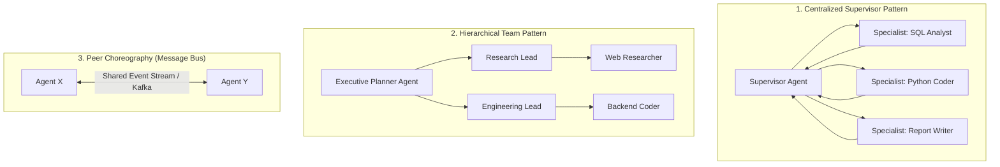

# Multi-Agent Topologies & Choreography

## 1. Multi-Agent Design Patterns

---

## 2. Invariant: Structured Communication Schemas
Agents in a multi-agent system must **never communicate via raw, unstructured natural language chat**. Inter-agent messages must be serialized into strict JSON Schemas (defining sender, recipient, task_id, status, and payload) to prevent circular misunderstandings and hallucinated conversational loops.
