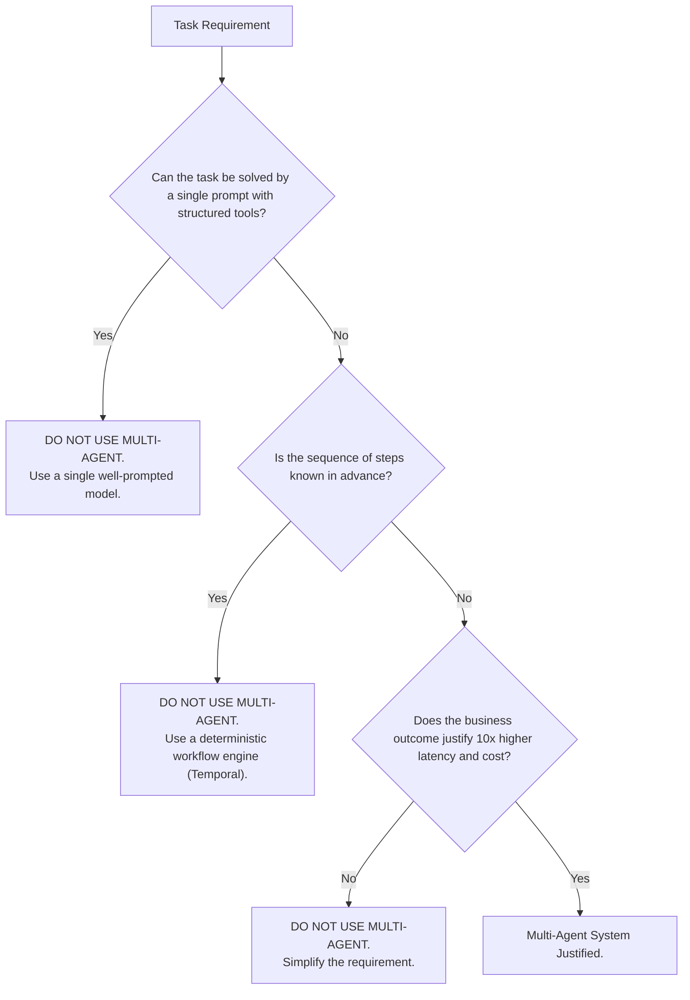

# When NOT to Use Multi-Agent Systems

## 1. The Multi-Agent Hype Trap

A pervasive architectural failure is deploying multi-agent frameworks (e.g., AutoGen, CrewAI) for tasks that are trivially solved by a single prompt or a deterministic Python script.

---

## 2. Lethal Failure Modes of Multi-Agent Deployments
1. **Echo Chambers**: Agent A hallucinates a false premise; Agent B accepts it as truth and elaborates; Agent C synthesizes a disastrously wrong final recommendation with high confidence.
2. **Non-Deterministic Debugging**: When an outage occurs, tracing which agent made the erroneous assumption across 20 asynchronous message exchanges requires hours of manual forensic analysis.
