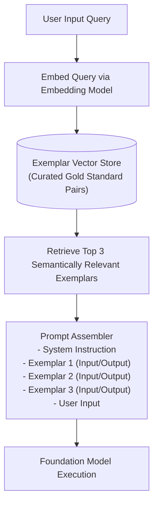

# Few-Shot & In-Context Learning Architecture

## 1. Zero-Shot vs. Few-Shot Performance

Large Language Models learn in-context. Providing 3 to 5 high-quality input-output exemplars (Few-Shot Prompting) dramatically improves accuracy on structured extraction and reasoning tasks compared to pure natural language instructions (Zero-Shot).

---

## 2. Dynamic Few-Shot Exemplar Selection
Static few-shot examples embedded permanently into system prompts waste valuable context tokens on irrelevant examples. **Dynamic Few-Shot Selection** uses vector search to retrieve only those exemplars that are semantically similar to the current user's specific query, maximizing relevance while minimizing token consumption.
