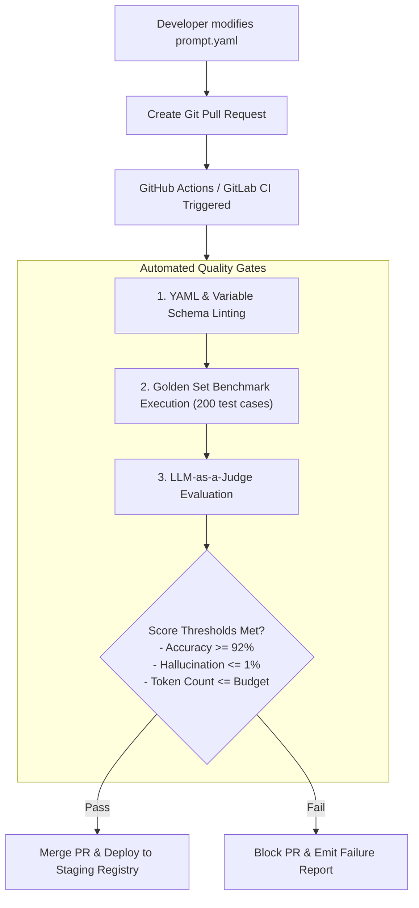

# Prompt Versioning & CI/CD Deployment Pipelines

## 1. Semantic Versioning (SemVer) for Prompts

Prompts must follow semantic versioning conventions to communicate impact to consuming microservices:
* **MAJOR (v2.0.0)**: Breaking output schema changes, major behavioral role alterations, or modified mandatory variable placeholders.
* **MINOR (v1.2.0)**: Added few-shot examples, improved phrasing that enhances accuracy without altering expected output structure.
* **PATCH (v1.1.1)**: Typo fixes, minor formatting adjustments, or defensive delimiter hardening.

---

## 2. The Automated Prompt CI/CD Pipeline

