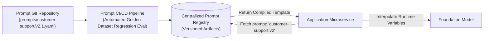

# Prompts as Code: Architecture & Separation of Concerns

## 1. The Anti-Pattern: Hardcoded Prompt Strings

Embedding raw multiline prompt strings directly inside application business logic (`const prompt = \`You are an assistant... ${query}\``) causes severe architectural degradation:
* Any prompt update requires a full software re-compilation and container redeployment.
* Prompt engineers cannot test modifications without modifying source code.
* No centralized audit trail exists to track who changed what instruction and why.

---

## 2. The Prompt Registry Architecture

Prompts must be treated as independent, versioned configuration artifacts managed in a centralized **Prompt Registry** (e.g., Langfuse, Agenta, custom Git repository):



### 2.1 Declarative YAML Prompt Specification
```yaml
prompt_id: "financial-reconciliation-assistant"
version: "2.3.0"
author: "architecture-team@enterprise.com"
model_requirements:
  recommended_model: "gpt-4o"
  min_context_window: 16384
  temperature: 0.0
parameters:
  - name: "transaction_id"
    type: "string"
    required: true
  - name: "ledger_context"
    type: "string"
    required: true
template: |
  You are an enterprise financial reconciliation assistant.
  Analyze the following ledger context and reconcile transaction: {{transaction_id}}.
  
  <ledger_data>
  {{ledger_context}}
  </ledger_data>
  
  Adhere strictly to the JSON schema provided.
```
